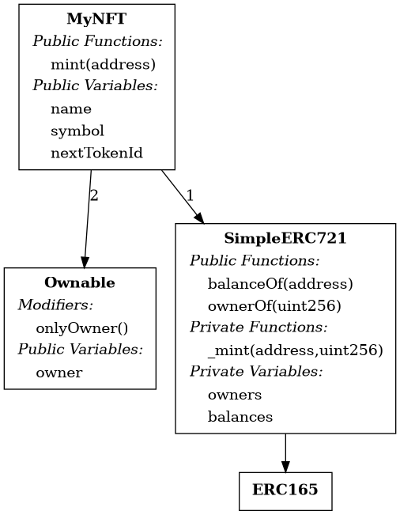

# Bao cao Lab 6: Security Automation va CI/CD

## Thong tin ca nhan

- Ho ten: TODO dien thong tin sinh vien
- MSSV: TODO dien MSSV
- Mon hoc: NT547 - Blockchain Nen tang, ung dung va bao mat
- Ngay thuc hien: 2026-05-13
- GitHub repo: https://github.com/jalike576/lab6-security-automation

## Moi truong

Do may bi chan cai package Python truc tiep bang `pip --user`, Slither duoc cai trong virtualenv cuc bo:

```bash
python3 -m venv .venv
.venv/bin/python -m pip install --upgrade pip
.venv/bin/python -m pip install slither-analyzer
.venv/bin/solc-select install 0.8.24
.venv/bin/solc-select use 0.8.24
```

Khi chay lai cac lenh ben duoi, dung:

```bash
PATH="$PWD/.venv/bin:$PATH"
```

## Yeu cau 1: Quet loi BadVault.sol

File da tao: `BadVault.sol`.

Lenh quet khong ap dung config loc nhieu:

```bash
printf '{}' >/tmp/slither-empty.json
PATH="$PWD/.venv/bin:$PATH" slither BadVault.sol --config-file /tmp/slither-empty.json
```

<!-- TODO screenshot: chup Terminal sau khi chay lenh tren, can thay danh sach detector va dong tong ket "6 result(s) found". -->

Ket qua Slither tim thay 6 finding. Cac loai loi tieu bieu:

- `reentrancy-eth`: `withdraw()` goi `msg.sender.call{value: amount}("")` truoc khi cap nhat `balances[msg.sender] = 0`, vi pham Checks-Effects-Interactions.
- `suicidal`: `suicide()` cho phep bat ky ai goi `selfdestruct(payable(owner))`.
- `solc-version`: dung pragma `^0.8.0`, pham vi compiler co nhung version da biet co issue.
- `low-level-calls`: dung low-level call trong `withdraw()`.
- `immutable-states`: `owner` co the khai bao `immutable`.
- `shadowing-builtin`: ham `suicide()` trung ten builtin/deprecated symbol.

## Yeu cau 2: Fix loi va quet lai GoodVault.sol

File da tao: `GoodVault.sol`.

```solidity
// SPDX-License-Identifier: MIT
pragma solidity 0.8.24;

contract GoodVault {
    mapping(address => uint256) public balances;
    address public immutable owner;
    bool private locked;

    error NoBalance();
    error TransferFailed();
    error ReentrantCall();

    modifier nonReentrant() {
        if (locked) revert ReentrantCall();
        locked = true;
        _;
        locked = false;
    }

    constructor() {
        owner = msg.sender;
    }

    function deposit() public payable {
        balances[msg.sender] += msg.value;
    }

    function withdraw() public nonReentrant {
        uint256 amount = balances[msg.sender];
        if (amount == 0) revert NoBalance();

        balances[msg.sender] = 0;

        (bool success, ) = payable(msg.sender).call{value: amount}("");
        if (!success) {
            revert TransferFailed();
        }
    }

    function getBalance() public view returns (uint256) {
        return address(this).balance;
    }
}
```

Lenh quet:

```bash
printf '{}' >/tmp/slither-empty.json
PATH="$PWD/.venv/bin:$PATH" slither GoodVault.sol --config-file /tmp/slither-empty.json
```

<!-- TODO screenshot: chup Terminal sau khi chay lenh tren, can thay Slither chi con finding `low-level-calls` va khong con High/Medium. -->

Ket qua: cac loi High/Medium da duoc khac phuc. Slither chi con `low-level-calls` do contract van dung `call` de gui ETH; finding nay chap nhan duoc trong bai vi code da dung CEI, check return value va co `nonReentrant`.

## Yeu cau 3: Slither config file

File da tao: `slither.config.json`.

```json
{
  "exclude_low": true,
  "exclude_informational": true,
  "detectors_to_exclude": "solc-version"
}
```

Lenh chay BadVault voi config:

```bash
PATH="$PWD/.venv/bin:$PATH" slither BadVault.sol --config-file slither.config.json
```

<!-- TODO screenshot: chup Terminal sau khi chay lenh tren, can thay Slither con 3 result(s) found, it hon ket qua Yeu cau 1 la 6 result(s) found. -->

Ket qua sau khi loc: con `reentrancy-eth`, `suicidal`, `immutable-states`. Detector `solc-version` va cac finding Low/Informational da duoc loc bo.

## Yeu cau 4: Printers va truc quan hoa

File mau da tao: `MyNFT.sol`, gom `Ownable`, `ERC165`, `SimpleERC721`, va `MyNFT` de co cay ke thua ro rang.

Lenh human-summary:

```bash
PATH="$PWD/.venv/bin:$PATH" slither MyNFT.sol --print human-summary
```

<!-- TODO screenshot: chup Terminal sau khi chay lenh tren, can thay bang summary co contract `MyNFT`, 8 functions, ERC165, va 0 high/medium issue. -->

Tom tat ket qua human-summary:

```text
Total number of contracts in source files: 4
Source lines of code (SLOC) in source files: 47
Number of high issues: 0
Number of medium issues: 0
MyNFT: 8 functions, ERC165, Complex code: No
```

Lenh tao inheritance graph:

```bash
PATH="$PWD/.venv/bin:$PATH" slither MyNFT.sol --print inheritance-graph
dot -Tpng MyNFT.sol.inheritance-graph.dot -o MyNFT.inheritance-graph.png
```

<!-- TODO screenshot: mo file `MyNFT.inheritance-graph.png` va chup hinh cay ke thua. Co the dung anh da tao trong thu muc nay hoac upload file `.dot` len GraphvizOnline. -->

Hinh cay ke thua da tao:



Y nghia khi audit du an lon: cay ke thua cho auditor thay nhanh contract nao ke thua logic nao, modifier nao co the anh huong den ham public, va thu tu override/multiple inheritance. Dieu nay giup phat hien rui ro bi che khuattrong base contract, logic phan quyen nam o contract cha, hoac xung dot override ma neu chi doc tung file rieng le se de bo sot.

## Yeu cau 5: GitHub Actions CI/CD

Repo GitHub: https://github.com/jalike576/lab6-security-automation

File workflow da tao: `.github/workflows/slither.yml`.

```yaml
name: Slither

on:
  push:
    branches:
      - main

jobs:
  slither:
    runs-on: ubuntu-latest
    steps:
      - name: Checkout repository
        uses: actions/checkout@v4

      - name: Run Slither
        uses: crytic/slither-action@v0.4.1
        with:
          target: BadVault.sol
          solc-version: 0.8.24
          fail-on: high
```

Workflow duoc cau hinh chay khi `push` vao nhanh `main`. Vi `BadVault.sol` co finding High (`reentrancy-eth`, `suicidal`), job se fail khi gap High Severity theo `fail-on: high`.

<!-- TODO screenshot: sau khi push len GitHub, vao repo -> tab Actions -> workflow `Slither`, chup man hinh run moi nhat. Can chup trang the hien job Slither fail do Slither tim thay loi High Severity trong `BadVault.sol`. -->

Co the kiem tra run bang GitHub CLI:

```bash
gh run list --repo jalike576/lab6-security-automation --limit 5
```

<!-- TODO screenshot tuy chon: chup Terminal lenh `gh run list --repo jalike576/lab6-security-automation --limit 5` de thay status workflow. -->

## Cau hoi tu duy

Static Analysis nhu Slither nhanh hon vi no doc ma nguon/AST/CFG va ap dung tap rule co san ma khong can deploy contract, sinh input, hay chay nhieu trang thai runtime. No co the quet toan bo code trong vai giay va chi phi tinh toan thap.

Nhung Static Analysis de co false positive hon Fuzzing hoac Formal Verification vi no khong biet day du ngu canh van hanh, invariant nghiep vu, gia tri runtime va rang buoc moi truong. Slither thuong bao theo pattern nguy hiem, vi vay mot pattern co the an toan trong ngu canh cu the van bi canh bao. Fuzzing kiem tra bang cach sinh input va thuc thi contract nen bang chung gan runtime hon, con Formal Verification chung minh theo dac ta nen chinh xac hon neu dac ta dung, nhung doi hoi thoi gian va cong suc lon hon.
